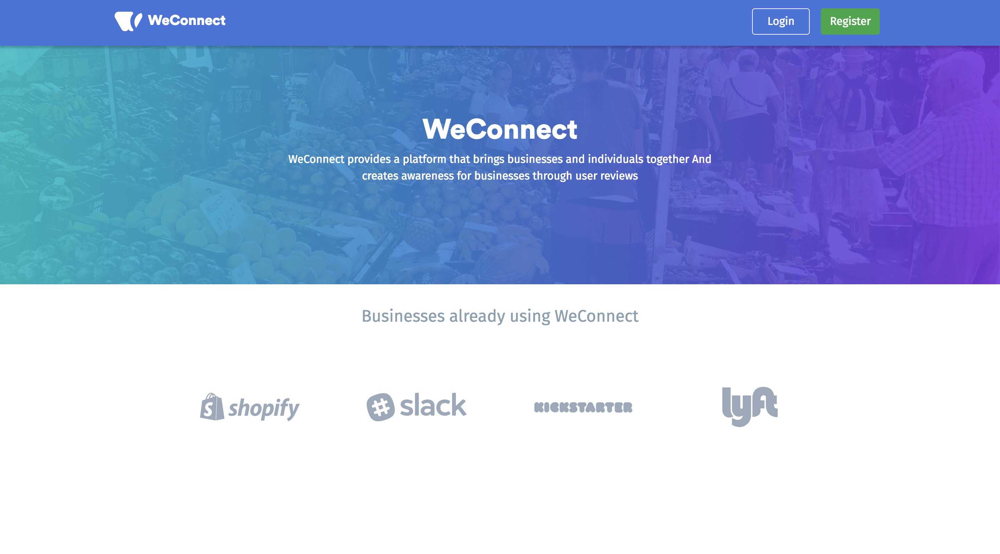

# react-weconnect

[](https://travis-ci.org/tibetegya/react-weconnect)
[](https://coveralls.io/github/tibetegya/react-weconnect?branch=master)

This is the WeConnect client application it is built using [React.js](https://reactjs.org/)
In order to run a working prototype of the application go to [WeConnect Portal](https://react-weconnect.herokuapp.com/)

If you want to build on top of this application clone this repository

```
    git clone https://github.com/tibetegya/react-weconnect.git
```

This project was built using `create-react-app` to build the project folder structure, use the command

Make sure you have `npm` and `react.js` installed on your system, to install react.js follow the instructions </br>
on this [link](https://reactjs.org/)

## Api Setup
In order to run the project locally you should glone the WeConnect backend python application which 
powers the api that this application consumes and depends on. 

Go to the [repository](https://github.com/tibetegya/WeConnect) and clone it or Clone the Weconnect application by running 

```
    git clone https://github.com/tibetegya/WeConnect.git
```

In order to run the WeConnect python Api application follow the instructions on the [repository](https://github.com/tibetegya/WeConnect) 

Make sure to have the backend server running at `http://127.0.0.1:5000`

## React Setup

After clonning this repository install the packages in the package.json file
After the installation yopu can run the application at `http://127.0.0.1:3000/`

it should look like this



## Testing

In order to test the application you can run the command 

```
    npm test
```

Run test coverage by running the command 

```
    npm test run coverage
```
## Check How App works on Heroku

In order to view the React application on heroku click on this [link](https://react-weconnect.herokuapp.com/)

